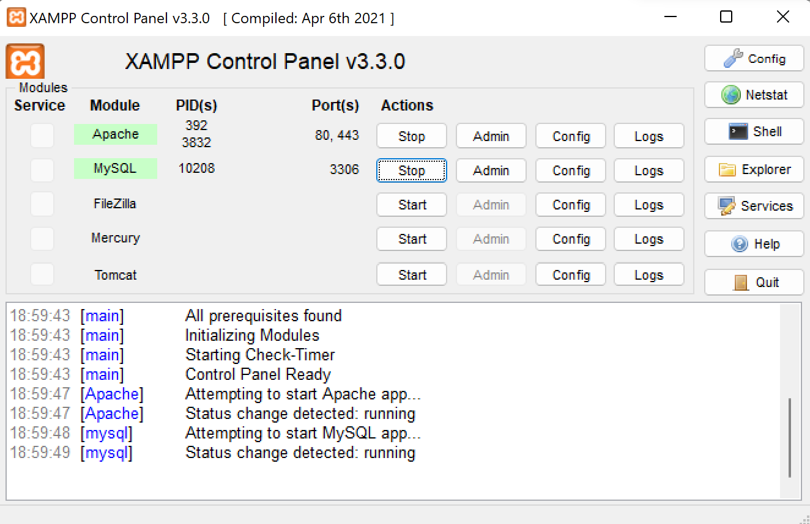
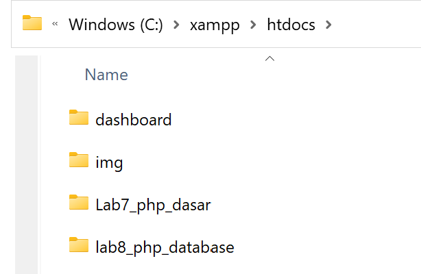
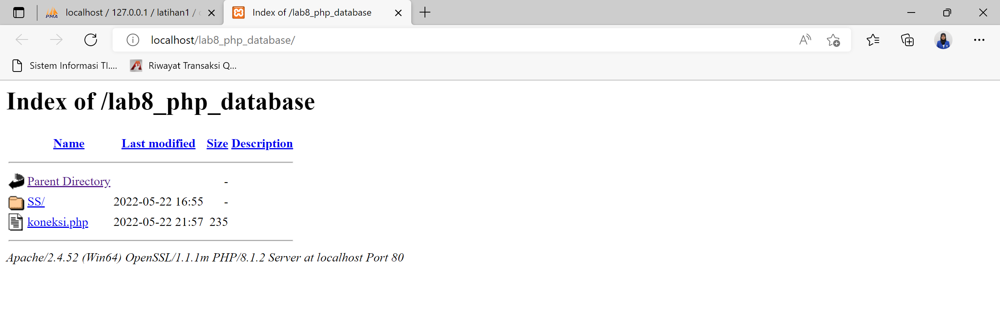
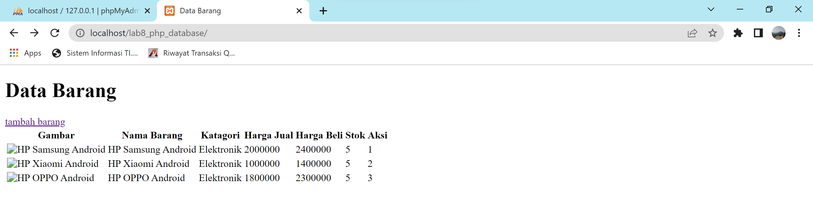
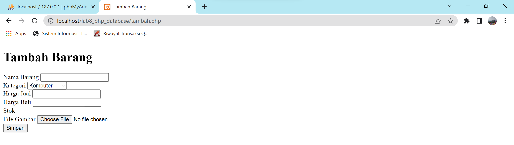

# Lab8Web
Repository ini dibuat untuk memenuhi Tugas Praktikum ke 8, mata kuliah Pemograman Web

Nama    : Miftahu Rizkiyah 
NIM     : 312010014 
Kelas   : TI.20.B1 

# PHP Dasar

Langkah-langkah Praktikum 

# Menjalankan MySQL Server
 

Mengakses MySQL Client menggunakan PHP MyAdmin
Pastikan webserver Apache dan MySQL server sudah dijalankan. Kemudian buka
melalui browser: http://localhost/phpmyadmin/

lalu kita membuat database, tabel dan juga menambahkan data

Membuat Program CRUD
Buat folder lab8_php_database pada root directory web server (d:\xampp\htdocs)

Kemudian untuk mengakses direktory tersebut pada web server dengan mengakses URL:
http://localhost/lab8_php_database/

Membuat file index untuk menampilkan data (Read)
Buat file baru dengan nama index.php

Menambah Data (Create)
Buat file baru dengan nama tambah.php

